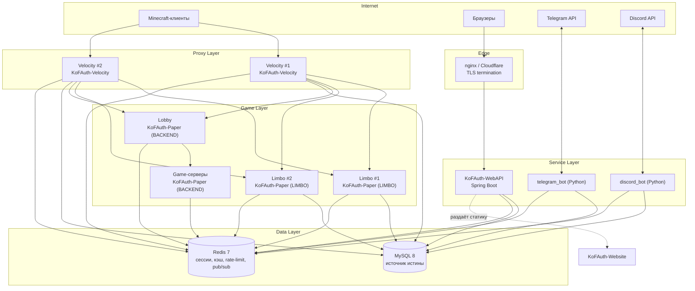
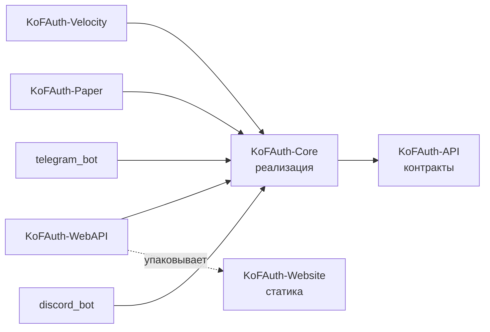
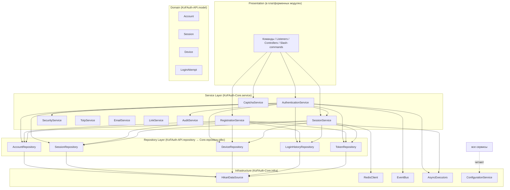
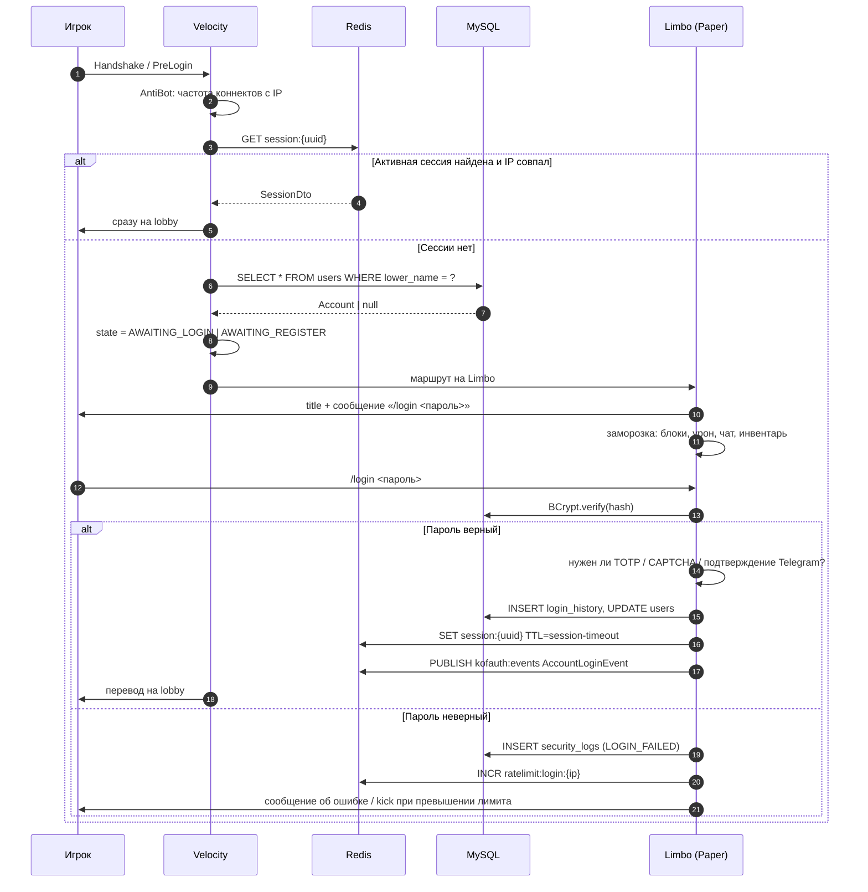
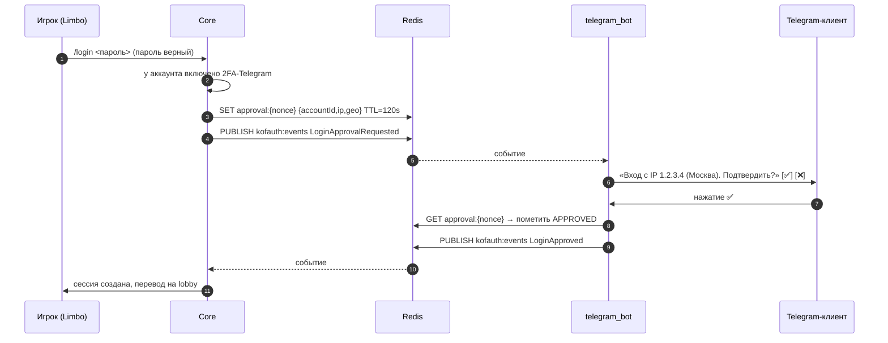
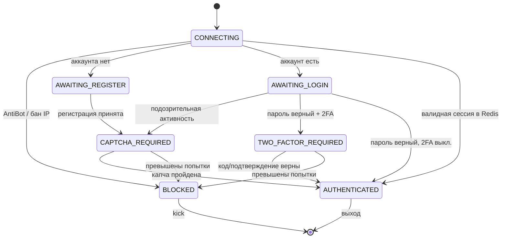

# KoFAuth — Архитектура системы

> Этап 1 из 17. Документ описывает целевую архитектуру всей платформы авторизации
> KoF Network. Все последующие этапы реализуют именно эту схему.

---

## 1. Цели и ограничения

### 1.1 Функциональные цели

| # | Цель | Где реализуется |
|---|------|-----------------|
| 1 | Игрок не может взаимодействовать с сетью до успешной аутентификации | `KoFAuth-Velocity` + `KoFAuth-Paper` (Limbo) |
| 2 | Единый аккаунт для Minecraft, сайта, Telegram и Discord | `KoFAuth-Core` |
| 3 | Многофакторная защита: пароль + TOTP/Telegram/Email | `KoFAuth-Core.security` |
| 4 | Полный аудит любых действий с аккаунтом | `security_logs`, `login_history` |
| 5 | Внешнее управление аккаунтом (сайт, боты) | `KoFAuth-WebAPI` |

### 1.2 Нефункциональные требования

| Требование | Значение | Как достигается |
|------------|----------|-----------------|
| Задержка проверки логина | p99 < 25 мс | Redis-кэш + Caffeine L1, prepared statements |
| Блокировка main-thread Minecraft | **0 мс** | Весь I/O в `CompletableFuture` на выделенных пулах |
| Горизонтальное масштабирование | N прокси, M бэкендов | Состояние сессий в Redis, а не в памяти процесса |
| Целевая онлайн-нагрузка | 5 000 CCU, 40 логинов/сек | Пул Hikari 20 соединений на процесс, Redis pipelining |
| Восстановление после падения Redis | Деградация, не отказ | Fallback на MySQL, `CacheProvider` с `NoopCache` |
| Перезагрузка конфигурации | Без рестарта | `ConfigurationService.reload()` + `ReloadableComponent` |

### 1.3 Явные архитектурные ограничения

1. **`KoFAuth-API` не зависит ни от чего**, кроме `slf4j-api`. Это гарантирует,
   что модуль можно скомпилировать в контексте Paper, Velocity, Spring и JDA
   без конфликтов classpath.
2. **`KoFAuth-Core` не знает о Minecraft.** В нём нет ни одного импорта
   `org.bukkit.*` или `com.velocitypowered.*`. Core тестируется обычными
   JUnit-тестами без запуска сервера.
3. **Платформенные модули не содержат бизнес-логики.** Они транслируют события
   платформы в вызовы сервисов Core и обратно — рендерят результат.
4. **Пароль в открытом виде не покидает границу процесса,** в котором был введён,
   и не логируется никогда. В `SecurityLog` пишется только факт события.

---

## 2. Топология развёртывания



**Ключевое решение:** Redis выступает не только кэшем, но и **шиной событий между
процессами** (`Pub/Sub`). Когда игрок меняет пароль на сайте, `KoFAuth-WebAPI`
публикует `PasswordChangedEvent` в канал `kofauth:events`, а все Velocity-прокси
получают его и разрывают активные игровые сессии этого аккаунта. Локальный
`EventBus` внутри JVM и распределённый `RedisEventBridge` — два уровня одной
абстракции `EventBus`.

---

## 3. Модули



| Модуль | artifactId | Артефакт | Назначение |
|--------|-----------|----------|------------|
| KoFAuth-API | `kofauth-api` | jar (библиотека) | Доменная модель, DTO, интерфейсы сервисов и репозиториев, события, enum'ы, `Result`-типы |
| KoFAuth-Core | `kofauth-core` | jar (библиотека) | Конфигурация, MySQL/Hikari/Flyway, Redis, криптография, JWT, TOTP, rate-limit, event bus, сервисный слой |
| KoFAuth-Velocity | `kofauth-velocity` | shaded jar | Плагин прокси: маршрутизация в Limbo, блокировка pre-login трафика, перевод на лобби |
| KoFAuth-Paper | `kofauth-paper` | shaded jar | Плагин Paper: Limbo-мир, защитные слушатели, CAPTCHA GUI, команды |
| KoFAuth-WebAPI | `kofauth-webapi` | executable jar | REST API + Swagger + раздача сайта |
| bots/apps/telegram_bot | `kofauth-telegram-bot` | образ Python | Telegram-бот |
| bots/apps/discord_bot | `kofauth-discord-bot` | образ Python | Discord-бот |
| KoFAuth-Website | — | статика | Личный кабинет (HTML/CSS/JS) |

---

## 4. Слои внутри Core



Правило зависимостей — **строго сверху вниз**. Репозиторий никогда не вызывает
сервис; сервис никогда не строит SQL.

---

## 5. Структура пакетов

Корневой пакет — `net.kofnetwork.auth`.

### 5.1 KoFAuth-API

```
net.kofnetwork.auth.api
├── KoFAuthProvider.java          # статическая точка доступа к KoFAuth (service locator для платформ)
├── KoFAuth.java                  # корневой фасад: доступ ко всем сервисам
├── model/                        # доменная модель (immutable records / entity-классы)
│   ├── IpAddress.java            # value-тип: VARBINARY(16), маскирование, подсети
│   ├── Account.java              # единственный класс с builder — 24 поля
│   ├── AccountStatus.java
│   ├── AuthState.java            # состояние машины входа + допустимые переходы
│   ├── Session.java
│   ├── SessionType.java
│   ├── Device.java
│   ├── DevicePlatform.java
│   ├── AuthToken.java
│   ├── TokenType.java
│   ├── LoginAttempt.java
│   ├── LoginResultType.java
│   ├── SecurityLogEntry.java
│   ├── SecurityEventType.java
│   ├── Severity.java
│   ├── EventSource.java
│   ├── EmailBinding.java
│   ├── TelegramBinding.java
│   ├── DiscordBinding.java
│   ├── TotpSecret.java
│   ├── TwoFactorMethod.java
│   ├── CaptchaChallenge.java
│   ├── CaptchaType.java
│   ├── CaptchaStatus.java
│   ├── Role.java
│   ├── Permission.java
│   ├── ServerNode.java
│   └── ServerType.java
├── dto/                          # объекты передачи данных между слоями и по сети
│   ├── RegistrationRequest.java
│   ├── LoginRequest.java
│   ├── AuthContext.java          # ip, userAgent, платформа, geo, deviceFingerprint
│   ├── AccountProfileDto.java
│   ├── SessionDto.java
│   ├── DeviceDto.java
│   └── ...
├── result/                       # типизированный результат вместо исключений
│   ├── AuthResult.java
│   ├── RegistrationResult.java
│   └── OperationResult.java
├── repository/                   # контракты доступа к данным (все методы async)
│   ├── AccountRepository.java
│   ├── SessionRepository.java
│   ├── DeviceRepository.java
│   ├── TokenRepository.java
│   ├── LoginHistoryRepository.java
│   ├── SecurityLogRepository.java
│   ├── EmailRepository.java      # привязки разделены по ISP: у e-mail, Telegram
│   ├── TelegramRepository.java   # и Discord разные операции, и общий интерфейс
│   ├── DiscordRepository.java    # заставлял бы каждого клиента зависеть от всех трёх
│   ├── TotpRepository.java
│   ├── CaptchaRepository.java
│   ├── RoleRepository.java
│   ├── ServerRepository.java
│   └── SettingsRepository.java
├── service/                      # контракты бизнес-логики
│   ├── AuthenticationService.java
│   ├── RegistrationService.java
│   ├── SessionService.java
│   ├── SecurityService.java
│   ├── CaptchaService.java
│   ├── EmailService.java
│   ├── TotpService.java
│   ├── LinkService.java
│   ├── TokenService.java
│   └── AuditService.java
├── event/                        # доменные события
│   ├── EventBus.java
│   ├── AuthEvent.java
│   ├── Subscribe.java
│   └── events/
│       ├── AccountRegisteredEvent.java
│       ├── AccountLoginEvent.java
│       ├── AccountLoginFailedEvent.java
│       ├── AccountLogoutEvent.java
│       ├── PasswordChangedEvent.java
│       ├── BindingChangedEvent.java
│       ├── SuspiciousActivityEvent.java
│       └── SessionInvalidatedEvent.java
├── config/                       # контракты конфигурации
│   ├── ConfigurationService.java
│   ├── Reloadable.java
│   └── section/                  # типобезопасные срезы конфигурации
└── exception/
    ├── KoFAuthException.java
    ├── RepositoryException.java
    └── ConfigurationException.java
```

### 5.2 KoFAuth-Core

```
net.kofnetwork.auth.core
├── KoFAuthCore.java              # сборка графа зависимостей, lifecycle: start/stop/reload
├── KoFAuthCoreBuilder.java
├── config/
│   ├── YamlConfigurationService.java
│   ├── YamlDocument.java         # обёртка над SnakeYAML с типобезопасным доступом
│   ├── ConfigFile.java           # enum: CONFIG, DATABASE, TELEGRAM, DISCORD, MAIL, CAPTCHA, SECURITY, VELOCITY, PAPER
│   └── section/
├── database/
│   ├── DatabaseManager.java      # владелец HikariDataSource + Flyway
│   ├── SqlExecutor.java          # безопасное выполнение prepared statements
│   ├── ResultSetMapper.java
│   └── migration/                # ресурсы db/migration/V*.sql
├── repository/jdbc/              # реализации репозиториев на JDBC
│   ├── JdbcAccountRepository.java
│   ├── JdbcSessionRepository.java
│   └── ...
├── cache/
│   ├── CacheProvider.java
│   ├── RedisCacheProvider.java   # Lettuce
│   ├── CaffeineL1Cache.java      # локальный кэш перед Redis
│   └── NoopCacheProvider.java    # graceful degradation
├── security/
│   ├── PasswordHasher.java       # BCrypt (cost из security.yml)
│   ├── PasswordPolicy.java       # проверка сложности
│   ├── AesCipher.java            # AES-256-GCM для секретов TOTP и токенов
│   ├── JwtProvider.java          # выпуск/валидация access и refresh токенов
│   ├── TokenGenerator.java       # криптостойкие одноразовые коды
│   ├── RateLimiter.java          # sliding window на Redis
│   ├── AntiBotGuard.java
│   ├── IpReputationService.java  # AntiVPN / proxy detection
│   └── ReplayGuard.java          # nonce-защита
├── service/impl/                 # реализации сервисов
├── event/
│   ├── SimpleEventBus.java       # локальная шина (sync + async)
│   └── RedisEventBridge.java     # межпроцессная доставка
├── concurrent/
│   ├── AsyncExecutors.java       # именованные пулы: db, io, mail, scheduler
│   └── NamedThreadFactory.java
├── mail/
│   ├── SmtpMailSender.java
│   └── MailTemplateEngine.java
└── util/
```

### 5.3 Платформенные модули

```
net.kofnetwork.auth.velocity          net.kofnetwork.auth.paper
├── KoFAuthVelocity.java              ├── KoFAuthPaper.java
├── listener/                         ├── mode/
│   ├── PreLoginListener.java         │   ├── LimboMode.java
│   ├── ServerPreConnectListener.java │   └── BackendMode.java
│   ├── CommandExecuteListener.java   ├── listener/protection/
│   ├── PlayerChatListener.java       │   ├── BlockProtectionListener.java
│   └── DisconnectListener.java       │   ├── DamageProtectionListener.java
├── session/                          │   ├── InteractionListener.java
│   └── ProxySessionTracker.java      │   └── VisibilityListener.java
├── limbo/                            ├── captcha/
│   ├── ServerPool.java               │   ├── GuiCaptchaRenderer.java
├── command/                          │   ├── ChatCaptchaRenderer.java
│   ├── LoginCommand.java             │   └── MapCaptchaRenderer.java
│   ├── RegisterCommand.java          ├── command/
│   └── AuthAdminCommand.java         └── world/
└── message/                              └── LimboWorldFactory.java
    └── MessageService.java               (Adventure MiniMessage)
```

---

## 6. Ключевые сценарии

### 6.1 Подключение и вход



### 6.2 Двухфакторное подтверждение через Telegram



Nonce одноразовый: `ReplayGuard` удаляет ключ атомарно через `GETDEL`, повторное
нажатие кнопки не создаст вторую сессию.

---

## 7. Модель состояния игрока



Состояние живёт в Redis (`authstate:{uuid}`), поэтому переключение игрока между
Limbo-инстансами не сбрасывает прогресс входа.

---

## 8. Сквозные механизмы

### 8.1 Асинхронность

Ни один вызов Core не выполняется в main-thread Minecraft. Контракт:

- Все методы репозиториев и сервисов возвращают `CompletableFuture<T>`.
- Пулы разделены по типу нагрузки, чтобы медленный SMTP не блокировал БД:

| Пул | Размер по умолчанию | Назначение |
|-----|--------------------|------------|
| `kofauth-db` | `hikari.maximumPoolSize` | JDBC-запросы |
| `kofauth-io` | `2 × CPU` | Redis, HTTP, geo-lookup |
| `kofauth-mail` | 2 | SMTP (заведомо медленный) |
| `kofauth-sched` | 2 | периодические задачи: чистка токенов, истёкшие сессии |

- Возврат в main-thread делает платформенный модуль:
  `future.thenAcceptAsync(result -> ..., platformMainThreadExecutor)`.

### 8.2 Кэширование

Двухуровневая схема: **Caffeine (L1, в процессе, TTL 30 с) → Redis (L2, общий) → MySQL**.
Инвалидация — через `Pub/Sub`: любой процесс, изменивший аккаунт, публикует
`cache:invalidate:{key}`, остальные чистят свой L1.

### 8.3 Безопасность

| Механизм | Реализация |
|----------|------------|
| Хэш пароля | BCrypt, cost 12 (настраивается), `at.favre.lib` |
| Шифрование секретов (TOTP, refresh) | AES-256-GCM, ключ из `security.yml`/ENV, random IV на запись |
| Токены | JWT HS512: access 15 мин, refresh 30 дней с ротацией |
| Rate limit | Sliding window в Redis: по IP, по аккаунту, по эндпоинту |
| AntiBot | Порог коннектов с IP/подсети, проверка на «пустой» handshake |
| AntiVPN / Proxy | Внешний IP-reputation провайдер + локальный кэш вердиктов |
| Replay | Одноразовые nonce через `GETDEL` |
| SQL Injection | Только `PreparedStatement`; конкатенация SQL запрещена архитектурно |
| XSS | Экранирование на выдаче в WebAPI + CSP-заголовки |
| CSRF | Double-submit cookie для cookie-сессий сайта |
| Session timeout | TTL в Redis + абсолютный лимит жизни сессии |

### 8.4 Конфигурация

Девять YAML-файлов, каждый — отдельный `ConfigFile`. Загрузка: чтение файла →
валидация схемы → построение immutable-объекта секции → атомарная публикация
через `AtomicReference`. Компоненты, которым нужен реальный «горячий» рестарт
(пул Hikari, Redis-подключение, SMTP-транспорт), реализуют `Reloadable` и
пересоздают ресурсы в `reload()`.

Приоритет источников: **переменные окружения → YAML → значения по умолчанию**.
Секреты (пароль БД, JWT-ключ, токены ботов) читаются из ENV в production.

---

## 9. Соответствие принципам

| Принцип | Как соблюдается |
|---------|-----------------|
| **S**ingle Responsibility | `AuthenticationService` только проверяет учётные данные; создание сессии — `SessionService`; запись аудита — `AuditService` |
| **O**pen/Closed | Новый способ CAPTCHA = новая реализация `CaptchaRenderer`, без правки `CaptchaService` |
| **L**iskov | Любой `CacheProvider` (Redis/Noop/Caffeine) взаимозаменяем; `NoopCacheProvider` не бросает, а возвращает пустые значения |
| **I**nterface Segregation | Отдельные `AccountRepository`, `SessionRepository`, `TokenRepository` вместо одного `AuthRepository` |
| **D**ependency Inversion | Сервисы зависят от интерфейсов репозиториев; JDBC-реализации подставляются в `KoFAuthCoreBuilder` |
| DI | Ручной композиционный корень (`KoFAuthCoreBuilder`) — без рефлексии и без Guice, чтобы не тащить контейнер в плагин |
| Repository | Доступ к данным изолирован; сервис не знает про SQL |
| DTO | Наружу (REST, боты) уходят DTO, а не доменные сущности с хэшами |
| Event Bus | `EventBus` локально + `RedisEventBridge` между процессами |

---

## 10. План этапов

| Этап | Содержание | Артефакт |
|------|-----------|----------|
| 1 | Архитектура, Maven-скелет | `docs/01-ARCHITECTURE.md`, `pom.xml` ×8 |
| 2 | Схема БД, миграции Flyway | `sql/`, `docs/02-DATABASE.md` |
| 3–4 | API-контракты + Core | `kofauth-api`, `kofauth-core` |
| 5 | Velocity-плагин | `kofauth-velocity` |
| 6 | Limbo | `kofauth-paper` (режим LIMBO) |
| 7–8 | Регистрация и вход | команды, сервисы |
| 9 | CAPTCHA | 4 рендерера |
| 10 | Email | SMTP, шаблоны, коды |
| 11 | Telegram | бот, 9 команд, уведомления |
| 12 | Discord | slash-команды, OAuth2 |
| 13 | Website | личный кабинет |
| 14 | REST API | контроллеры, Swagger |
| 15 | Тестирование | unit + integration (Testcontainers) |
| 16 | Docker | compose, образы |
| 17 | Production Ready | метрики, health-checks, runbook |

---

## 11. Как собрать

```bash
mvn clean install -DskipTests
```

Требуется JDK 21+ (проект компилируется с `--release 21`). Артефакты:

- `KoFAuth-Velocity/target/KoFAuth-Velocity-1.0.0-SNAPSHOT.jar` → `velocity/plugins/`
- `KoFAuth-Paper/target/KoFAuth-Paper-1.0.0-SNAPSHOT.jar` → `paper/plugins/`
- `KoFAuth-WebAPI/target/KoFAuth-WebAPI-1.0.0-SNAPSHOT.jar` → `java -jar`
- боты собираются отдельно: `bots/docker/Dockerfile`, один образ на обоих
  (`python -m telegram_bot` / `python -m discord_bot`)
