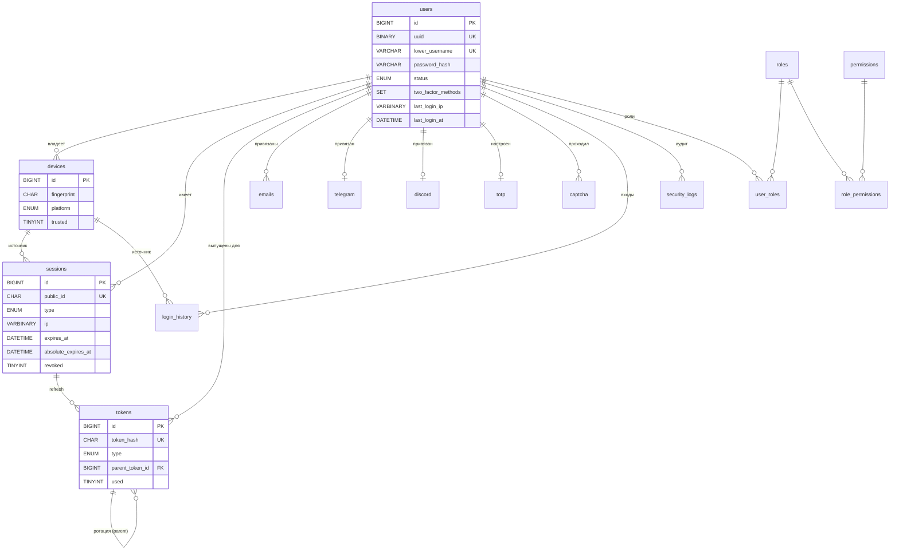

# KoFAuth — База данных

> Этап 2 из 17. Схема MySQL 8, миграции Flyway, соглашения и модель данных Redis.

---

## 1. Источник истины

Структура базы описана **только** миграциями Flyway:

```
KoFAuth-Core/src/main/resources/db/migration/
├── V1__baseline_schema.sql   # 17 таблиц
└── V2__default_data.sql      # роли, права, настройки по умолчанию
```

Отдельного «эталонного дампа» нет намеренно: два источника истины расходятся
в первый же месяц. Схему на чистой базе разворачивает `DatabaseManager` при
старте любого процесса KoFAuth; конкурентные запуски безопасны — Flyway берёт
блокировку на таблице `flyway_schema_history`.

Правила изменения схемы:

1. Существующие `V*.sql` **никогда** не редактируются после мержа в `main` —
   у Flyway они уже посчитаны по контрольной сумме.
2. Изменение = новый файл `V{N+1}__описание.sql`.
3. Разрушительные операции (`DROP COLUMN`, сужение типа) выносятся в отдельную
   миграцию, применяемую спустя релиз после того, как код перестал читать колонку.

---

## 2. ER-диаграмма



---

## 3. Таблицы

| Таблица | Назначение | Особенности |
|---------|-----------|-------------|
| `users` | Аккаунт | `lower_username` — ключ поиска; `two_factor_methods` — `SET`, допускает несколько активных факторов одновременно |
| `sessions` | Сессии всех платформ | Два срока жизни: скользящий `expires_at` и жёсткий `absolute_expires_at` |
| `devices` | Устройства аккаунта | `UNIQUE(account_id, fingerprint)`; `trusted` снимает требование 2FA |
| `emails` | Привязки почты | Несколько адресов на аккаунт, один `is_primary` |
| `telegram` | Привязка Telegram | 1:1 в обе стороны — два `UNIQUE` |
| `discord` | Привязка Discord | OAuth-токены зашифрованы AES-256-GCM |
| `totp` | Google Authenticator | `enabled` включается только после подтверждения кодом; `last_used_counter` — анти-replay |
| `captcha` | Челленджи | Хранится SHA-256 ответа, не сам ответ |
| `security_logs` | Аудит | `event_type` — `VARCHAR`, новые события не требуют миграции |
| `login_history` | Входы | Пишется и успех, и неудача, включая несуществующие ники |
| `tokens` | Токены | Только хэш; `parent_token_id` даёт цепочку ротации refresh |
| `roles` / `permissions` | RBAC | + связки `role_permissions`, `user_roles` |
| `servers` | Реестр серверов | Heartbeat + балансировка по `priority` |
| `settings` | Динамические настройки | Меняются без рестарта; `setting_key`, т.к. `key` — зарезервированное слово |

Итого 17 таблиц: 15 из технического задания плюс две связки many-to-many
(`role_permissions`, `user_roles`), без которых RBAC пришлось бы хранить строкой.

Резервные коды TOTP отдельной таблицы не получили: у них ровно та же семантика,
что у остальных одноразовых токенов (хэш + однократное использование + срок), и
они живут в `tokens` с `type = 'TOTP_RECOVERY'`.

---

## 4. Соглашения по типам

| Данные | Тип | Почему |
|--------|-----|--------|
| Время | `DATETIME(3)` UTC | `TIMESTAMP` упирается в 2038 год и неявно конвертирует часовой пояс соединения |
| IP | `VARBINARY(16)` | Вмещает IPv4 (4 байта) и IPv6 (16), индекс компактнее строкового |
| UUID | `BINARY(16)` | 16 байт против 36 у `CHAR(36)` — вдвое меньше индекс |
| Внешние идентификаторы | `CHAR(36)` UUIDv4 | Не связаны с автоинкрементом, не раскрывают объём базы |
| Пароль | `VARCHAR(100)` | BCrypt даёт 60 символов; запас на переход к Argon2id |
| Секреты | `VARBINARY` | Результат AES-256-GCM: `IV ‖ ciphertext ‖ tag` |
| Токены | `CHAR(64)` | SHA-256 в hex; сырое значение не хранится нигде |

**Часовые пояса.** Java всегда пишет и читает UTC (`Instant`). JDBC-URL содержит
`connectionTimeZone=UTC&preserveInstants=true`, чтобы драйвер не применял
локальный пояс приложения.

---

## 5. Индексы

Индексы подобраны под реальные запросы, а не «на всякий случай»:

| Индекс | Обслуживает |
|--------|-------------|
| `uk_users_lower_username` | Поиск аккаунта при каждом подключении — самый горячий запрос |
| `idx_users_registration_ip` | AntiBot: сколько аккаунтов зарегистрировано с IP |
| `idx_sessions_account_active (account_id, revoked, expires_at)` | «Активные сессии аккаунта» на сайте и в `/auth sessions` |
| `idx_sessions_expires` | Фоновая чистка протухших сессий |
| `uk_tokens_hash` | Предъявление токена: единственный способ его найти |
| `idx_tokens_account_type (account_id, type, used, revoked)` | «Действующий код подтверждения для аккаунта» |
| `idx_login_history_account_time` | `/auth logs`, история в личном кабинете |
| `idx_login_history_ip_time` | Расследование: все входы с подозрительного IP |
| `idx_security_logs_severity_time` | Лента критических событий для админов |
| `uk_devices_account_fingerprint` | Upsert устройства при каждом входе |

Порядок колонок в составных индексах — от самой селективной равенство-колонки к
диапазонной (`created_at`, `expires_at`) последней: только так диапазон
дочитывается по индексу без filesort.

---

## 6. Целостность и каскады

| Связь | Правило | Обоснование |
|-------|---------|-------------|
| `devices`, `sessions`, `tokens`, `emails`, `telegram`, `discord`, `totp`, `captcha`, `login_history` → `users` | `ON DELETE CASCADE` | Удаление аккаунта не должно оставлять действующие сессии и токены |
| `security_logs` → `users` | `ON DELETE SET NULL` | Журнал аудита переживает удаление аккаунта; иначе исчезнут следы инцидента |
| `sessions.device_id`, `login_history.device_id` → `devices` | `ON DELETE SET NULL` | Игрок вправе удалить устройство, не стирая историю |
| `tokens.parent_token_id` → `tokens` | `ON DELETE SET NULL` | Разрыв цепочки ротации не должен удалять потомков |
| `settings.updated_by` → `users` | `ON DELETE SET NULL` | Настройка переживает удалённого администратора |

---

## 7. Модель данных Redis

MySQL — источник истины, Redis — горячий слой. Потеря Redis не теряет данные,
только заставляет перечитать их из MySQL.

| Ключ | Тип | TTL | Содержимое |
|------|-----|-----|-----------|
| `kofauth:session:{uuid}` | Hash | `session.ttl` | Активная игровая сессия: `accountId`, `ip`, `publicId`, `issuedAt` |
| `kofauth:authstate:{uuid}` | String | 5 мин | Состояние машины входа: `AWAITING_LOGIN`, `CAPTCHA_REQUIRED`, ... |
| `kofauth:account:{lowerName}` | Hash | 5 мин | Кэш строки `users` (без `password_hash`) |
| `kofauth:ratelimit:{scope}:{key}` | Sorted Set | окно | Sliding window: метки времени попыток |
| `kofauth:approval:{nonce}` | String | 2 мин | Запрос подтверждения входа через Telegram/Discord |
| `kofauth:captcha:{uuid}` | Hash | `captcha.ttl` | Текущий челлендж и число попыток |
| `kofauth:ipreputation:{ip}` | String | 12 ч | Вердикт AntiVPN, чтобы не дёргать внешний API |
| `kofauth:events` | Pub/Sub | — | Межпроцессная шина доменных событий |
| `kofauth:cache:invalidate` | Pub/Sub | — | Сброс L1-кэша Caffeine на всех узлах |

Префикс `kofauth:` настраивается в `database.yml` — одна инстанция Redis может
обслуживать несколько окружений.

**Почему `password_hash` не кэшируется.** Хэш нужен ровно один раз за вход, и
цена его чтения из MySQL ничтожна на фоне самой проверки BCrypt (~100 мс при
cost 12). Держать его в Redis — расширять поверхность атаки без выигрыша.

---

## 8. Обслуживание

Фоновый планировщик (`kofauth-sched`) выполняет:

| Задача | Период | SQL |
|--------|--------|-----|
| Удаление протухших токенов | 1 ч | `DELETE FROM tokens WHERE expires_at < UTC_TIMESTAMP(3) AND (used = 1 OR revoked = 1)` |
| Пометка истёкших сессий | 5 мин | `UPDATE sessions SET revoked = 1, revoked_reason = 'TIMEOUT' WHERE revoked = 0 AND expires_at < UTC_TIMESTAMP(3)` |
| Чистка старых CAPTCHA | 1 ч | `DELETE FROM captcha WHERE expires_at < DATE_SUB(UTC_TIMESTAMP(3), INTERVAL 1 DAY)` |
| Ротация аудита | сутки | `DELETE FROM security_logs WHERE severity = 'INFO' AND created_at < DATE_SUB(UTC_TIMESTAMP(3), INTERVAL 90 DAY)` |

Записи `WARNING` и `CRITICAL` в `security_logs` не удаляются автоматически.

Оценка роста при 5 000 CCU: `login_history` ≈ 15 тыс. строк/сутки (~2 МБ),
`security_logs` ≈ 40 тыс. строк/сутки (~8 МБ). При превышении 50 млн строк
`login_history` разбивается на партиции по `created_at` (`RANGE`) отдельной
миграцией — структура таблицы к этому готова: `created_at` входит во все её индексы.

---

## 9. Проверка схемы

Схема прогнана на **MySQL 8.0.46** (образ `mysql:8.0`). Воспроизвести:

```bash
docker run -d --name kofauth-mysql-check -e MYSQL_ROOT_PASSWORD=root -e MYSQL_DATABASE=kofauth -p 33061:3306 mysql:8.0
```

```bash
docker exec -i kofauth-mysql-check mysql -uroot -proot kofauth < KoFAuth-Core/src/main/resources/db/migration/V1__baseline_schema.sql
```

### Что подтвердилось

| Проверка | Результат |
|----------|-----------|
| Обе миграции применяются на чистой базе | без ошибок |
| Создано таблиц | 17 |
| Внешних ключей | 21 |
| Индексов | 66 |
| Стартовые данные | 7 ролей, 24 права, 60 связок, 17 настроек |
| Права ролей | player 8, moderator 7, admin 21 (24 − 3), owner 24 |
| Повторный прогон `V2` | счётчики не изменились — `INSERT IGNORE` идемпотентен |
| `VARBINARY(16)` для IP | IPv4 занимает 4 байта, IPv6 — 16, оба читаются обратно без потерь |
| `SET` для второго фактора | `'TOTP,TELEGRAM'` пишется и ищется через `FIND_IN_SET` |
| Уникальность ника | вставка `STEVE` при существующем `steve` отвергнута по `uk_users_lower_username` |
| Каскады | удаление аккаунта убрало записи из `devices`, `sessions`, `tokens`, `emails`, `telegram`, `totp`, `login_history` |
| Сохранность аудита | строки `security_logs` остались, `account_id` обнулён — след инцидента переживает удаление аккаунта |

### Планы выполнения горячих запросов

| Запрос | Индекс | Примечание |
|--------|--------|-----------|
| поиск аккаунта по нику | `uk_users_lower_username` | 1 строка |
| активные сессии аккаунта | `idx_sessions_account_active` | index condition pushdown |
| токен по хэшу | `uk_tokens_hash` | доступ по уникальному ключу |
| история входов, свежие сверху | `idx_login_history_account_time` | **backward index scan**, без filesort |

Последняя строка — практическое подтверждение правила из раздела 5: диапазонная
колонка (`created_at`) стоит в составном индексе последней, поэтому
`ORDER BY created_at DESC` обслуживается обратным проходом по индексу, а не сортировкой.

Интеграционный тест `DatabaseMigrationIT` (этап 15) закрепит эти проверки в CI
через Testcontainers.
